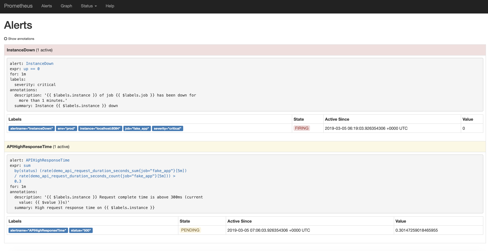

# DevOps Playground Singapore: Exploring metrics with Prometheus


- [Introduction](#introduction)
- [Requirements](#requirements)
- [Setup](#setup)
- [Hands On](#hands-on)
    - [1. Install Prometheus](#install-prometheus)
    - [2. First Start of Prometheus](#first-start-of-prometheus)
    - [3. Create Prometheus Configuration File](#kill-the-current-prometheus-process-and-create-a-config-file-playground.yml)
    - [4. Start Prometheus With Configuration](#start-prometheus-in-the-background-with-the-config-file)
    - [5. Install Fake Application](#installing-the-fake-app-service)
    - [6. Install Node Exporter](#installing-node_exporter)
    - [7. Prometheus Query](#querying)
    - [8. Prometheus Alerts](#alerting-basics)
    - [9. Install and Configure Grafana](#installing-and-configuring-grafana)
- [Conclusion](#conclusion)
- [Resources](#resources)
- [Appendix](#appendix)
    - [Setting up the Playground Environment](#setting-up-the-playground-environment)
    - [Tearing down the Playground Environment](#tearing-down-the-playground-environment)

## Introduction

On this Playground we're going to install Prometheus on a server, alongside with a fake application that produces metrics, and a service that collects system metrics. We'll then explore Prometheus' UI and learn the basic query types. Lastly we will setup Grafana and present the Prometheus metrics as dashboard.

**Name:** Melvin Cheng  
**Role:** DevOps And Continuous Delivery Consultant  
**Email:** melvin@ecs-digital.co.uk  


## Requirements

* Modern browser with JS enabled or Terminal or Putty
* Minimal knowledge of how an ssh terminal works.

## Setup

* Open the web terminal (web terminal: http://`<ip-address>`
* Your Actual host name and user/pass are assigned at the start of the presentation.
* Log in to your instance.
* You can clone this repo but it's not necessary to complete the tasks.
* You are set.

## Hands-On

### Install `Prometheus`

Prometheus is pre-downloaded on your machine inside the /binaries folder, but you can easily download them with the following commands:

```bash
cd ~
mkdir prometheus
wget https://github.com/prometheus/prometheus/releases/download/v2.7.1/prometheus-2.7.1.linux-amd64.tar.gz -P ~/binaries
tar zxvf ./binaries/prometheus-2.7.1.linux-amd64.tar.gz -C ./prometheus --strip-components 1

```

### First start of prometheus:

Let's explore prometheus on it's on first. Let's start the service, and check if the UI works. Once you've started the process, please in a new browser tab, open http://`<ip-address>`:8081

```bash
cd prometheus
./prometheus --web.listen-address=:8081 
```

Explore the UI:


* **Status/Targets.** This is where you can see all your configured target services you're monitoring, and their state. At first you'll  only see one target, which is prometheus itself.
* **Graph.** This is where we'll send queries to our Prometheus instance, and can see the results in text and in graph formats. Note: This is mainly for exploring, not for building dashboards.
* **Alerts.** Where you'll see the triggered alerts.

### Kill the current prometheus process and create a config file playground.yml

`CTRL+C`

Paste the following section into the file:

```bash
nano playground.yml
```
Paste the following section

```yaml
global:
  scrape_interval:     15s
  evaluation_interval: 15s

scrape_configs:
  - job_name: 'prometheus'
    static_configs:
      - targets: ['localhost:8081']

  - job_name: 'fake_app'
    static_configs:
      - targets: ['localhost:8084','localhost:8082']  
        labels:  
          env: prod
      - targets: ['localhost:8083']  
        labels:  
          env: dev

  - job_name: 'node_stats'
    static_configs:
      - targets: ['localhost:9100']
```

`CTRL+O`  <kbd>Enter</kbd>   
`CRTL+X`  


Explanation:
We'll use 4 targets in our playground. One will be a service that monitors the server's health, and 3 targets of the same fake application, created by Julius. These targets will allow us to explore the querying capabilities of Prometheus.

### Start prometheus in the background with the config file

```bash
nohup ./prometheus --web.enable-lifecycle --config.file=playground.yml --web.listen-address=:8081 &
```

Once started, check out the UI again, and check out the targets.

### Installing the fake app service

It's already installed on your instance, but if there's any issue, you can reinstall it with the following commands

```bash
cd ~
mkdir fake_app
wget https://github.com/juliusv/prometheus_demo_service/releases/download/0.0.4/prometheus_demo_service-0.0.4.linux.amd64.tar.gz -P ~/binaries
tar zxvf ./binaries/prometheus_demo_service-0.0.4.linux.amd64.tar.gz -C ./fake_app
```

After installing, let's start the fake services:

```bash
fake_app/prometheus_demo_service -listen-address :8082 &
fake_app/prometheus_demo_service -listen-address :8083 &
fake_app/prometheus_demo_service -listen-address :8084 &
```

Once started check out the demo service in a browser, to see how an exporter works, and the data looks like. Open a new tab for http://`<ip-address>`:8081/metrics

### Installing node_exporter

Node Exporter is the official system metrics engine for Prometheus. It's already installed on your system, but in case any problems, here's the commands to install it:

```bash
cd ~
mkdir node_exporter
wget https://github.com/prometheus/node_exporter/releases/download/v0.17.0/node_exporter-0.17.0.linux-amd64.tar.gz -P ~/binaries
tar zxvf ./binaries/node_exporter-0.17.0.linux-amd64.tar.gz -C node_exporter --strip-components 1
```

Once installed, start the service:

```bash
cd node_exporter
./node_exporter &
```

### Querying


* if not open, please go to http://`<ip-address>`:8081
* graph
  * execute the query `http_requests_total`. Notice the data format. The main metric name on the left, value on the right. In the middle, you can see all the 'dimensions'. These k/v pairs work as filters too.
  * `http_requests_total{job='fake_app'}`. We can have as many filters as we can, and as many we have in out metrics. Like:
  * `http_requests_total{job='fake_app',env='prod'}`. Now that we have a reasonably filtered list, let's have a look at the Graph view.
  * Notice that these values are ever growing, since we're measuring the total number of requests arrived to the service since the start of the service at any given moment in time. Normally, we don't really care about the total number, we usually prefer to see something like "how many requests arrived between \<your interval here> "
  * `rate(http_requests_total{job='fake_app',env='prod'}[5m])`. This is a function that we've used here. There a good number of these functions we can use to aggregate and/or do calculations on the data we've got. Please see the **Useful links** section for reference.
  * `node_memory_MemFree_bytes`. Check this out. also run the command `top` in your terminal, to see if the numbers are a match. They're close, but they're not exactly. Reason is that in prometheus we see the metrics in bytes. Need to transfer it to kBytes. So let's run this:
  * `node_memory_MemFree_btyes / 1024` # Now they're really close. Ok, let's see another math operation:
  * `(node_memory_MemFree_bytes / node_memory_MemTotal_bytes) * 100`. Notice that we can do basic math operations just fine. Ok, let's try something else.
  * `demo_api_request_duration_seconds_count`. So what we see here, is the number of API requests that took some time to complete.
  * `demo_api_request_duration_seconds_count{path=~'.*bar',status!='200'}` Notice, we can use logical expressions like !=, and regex expressions to filter our metrics. Ok, let's see a graph of this result, and notice that it's a counter, so let's make it a bit more pretty with a `rate()` function, then look at the graph again. It's a lot nicer, but a little too scattered. How can we summarize all the series in the result and display as one line in the graph?
  * `sum(rate(demo_api_request_duration_seconds_count{job="fake_app"}[5m]))` But let's say i don't want to summarise all the series to one, but want to summarise it by status
  * `sum by(status) (rate(demo_api_request_duration_seconds_count{job="fake_app"}[5m]))`
  * `sum by(status,path) (rate(demo_api_request_duration_seconds_count{job="fake_app"}[5m]))`
  * `rate(demo_api_request_duration_seconds_sum{job="fake_app"}[30s])` Let's go back to this metric group for one last time, but this time, we choose a different metric. This metric collects the actual time spend receiving a request. Question? How can we check how long one request take on average?
  * `sum by(status) (rate(demo_api_request_duration_seconds_sum{job="fake_app"}[5m]) / rate(demo_api_request_duration_seconds_count{job="fake_app"}[5m]))` So we can see that resolving a 404 is pretty quick, and as you would expect, resolving a 200 is a bit slower. Now. How can we check if the request time is higher than we'd like it to be?
  * `sum by(status) (rate(demo_api_request_duration_seconds_sum{job="fake_app"}[5m]) / rate(demo_api_request_duration_seconds_count{job="fake_app"}[5m])) > 0.3`. Ok, so how can we make Prometheus trigger an alert if this event happens next?

  Before we look at how to set up alerts in prometheus let's do two more things quick:

  * `up`
  * now kill one of the exporters on your instance. eg: `pkill -f -- :8084`. See how the state changes in prometheus. check...
  * `up == 0`


### Alerting basics



Alerting has two components in prometheus.

1. The alerting rule files for the prometheus executable.
2. The alertmanager executable and it's config

In prometheus you create alerts based on rules, which is stored in a config yaml file like the main config file. Alertmanager then connects to the running prometheus instance to scrape the alerts.

* edit our main Prometheus config file `playground.yml` and append the following section at the end of the file:

```bash
cd ~/prometheus
nano playground.yml
```

Append the following section

```bash
rule_files:
  - './alerts.d/*'
```
`CTRL+O`  <kbd>Enter</kbd>   
`CTRL+X`  


* create a alerts.yml (alerts.yml) file inside the `./alerts.d/` directory.  

```bash
mkdir alerts.d && cd alerts.d
nano alerts.yml
```

Paste the following section into the alerts.yml file.  

```yaml
groups:
- name: example
  rules:
  # Alert for any instance that is unreachable for >1 minutes.
  - alert: InstanceDown
    expr: up == 0
    for: 1m
    labels:
      severity: critical
    annotations:
      summary: "Instance {{ $labels.instance }} down"
      description: "{{ $labels.instance }} of job {{ $labels.job }} has been down for more than 1 minutes."

  # Alert for any instance that a request took more than 300 ms to complete.
  - alert: APIHighResponseTime
    expr: sum by(status) (rate(demo_api_request_duration_seconds_sum{job="fake_app"}[5m]) / rate(demo_api_request_duration_seconds_count{job="fake_app"}[5m])) > 0.3
    for: 1m
    annotations:
      summary: "High request response time on {{ $labels.instance }}"
      description: "{{ $labels.instance }} Request complete time is above 300ms (current value: {{ $value }}s)"
```
`CTRL+O`  <kbd>Enter</kbd>   
`CTRL+X`  

* Now issue this command on the terminal to reload the config files:  

```bash
curl -X POST http://localhost:8081/-/reload
```


### Installing and Configuring `Grafana`

Grafana is one of the best open source visualization tools. It can be easily integrated with Prometheus for visualizing all the target metrics. 

#### Install grafana

```bash
cd ~
mkdir grafana
wget https://dl.grafana.com/oss/release/grafana-6.0.0.linux-amd64.tar.gz -P ~/binaries
tar zxvf ./binaries/grafana-6.0.0.linux-amd64.tar.gz -C ./grafana --strip-components 1
```


Once unzipped, we need to modify the default port of Grafana

```bash
cd grafana/conf  
nano defaults.ini  
CTRL+\   
3000   
8080  
Y  
```
CTRL+O  <kbd>Enter</kbd>   
CRTL+X 

start the service:

```bash
cd ~/grafana/bin
./grafana-server &
```


On your local workstation, open a browser session and enter the following URL

https://grafana.com/api/dashboards/3662/revisions/2/download

A json file (prometheus-2-0-overview_rev2.json) will be downloaded to your local desktop. We will be using this file for our dashboard shortly.

Once you've have started the grafana process, open a new browser session URL http://`<ip-address>`:8080

Login username 'admin' password 'admin'. Choose skip in the next option

Click on the "Add data source" icon, select Prometheus from the list.

Under HTTP -> URL, enter `http://localhost:8081`

Click Save & Test

#### Configure Prometheus data source


Next we will import the dashboard from the json that we have downloaded earlier.

#### Import dashboard


Click on the "+" icon on the top left upper corner. Select Import.

Click on Upload .json File button and upload the json file  (prometheus-2-0-overview_rev2.json) which we had downloaded earlier.

Under Options -> Prometheus, remember to locate your Prometheus data source entry. 

Click Import

The Prometheus dashboard will be created.


* And see the Alerts and the Status/Rules page in the Prometheus UI.

## Conclusion  

In this playground we had installed and configured a Prometheus instance to monitor the following

1. Server hardware and kernel related metrics 
2. Instrumenting a Go application

We have used PromQL (Prometheus Query Language) to select and aggregate time series data in real time, displaying them both in Metrics and Graph format. We then concluded our Prometheus section with Alerting which allowed us to define alert conditions based on the PromQL results.

We would advice users who are seriously looking into Prometheus for production to take into consideration the following during their planning phase.

1. Storage Capability - Understand how much and how often the metrics to be collected and stored.
2. Federation - Scaling Prometheus to allow a Prometheus server to scrape selected time series from another Prometheus server.

In the last section of the playground, we have demonstrated how to install and configure Grafana to consume the Prometheus metrics. We ended the playground by importing and presenting the metrics onto a Prometheus databoard.

We hope this playground has helped provide you with a better understanding of the monitoring capabilites provided by Prometheus and how those statuses can be easily displayed in a Grafana dashboard. Think about the service you are responsible for maintaining and see whether this playground can help you improve viability of the health of those services.

## Resources

### Prometheus

Prometheus Repo   
https://github.com/prometheus/prometheus

Prometheus Node exporter Repo  
https://github.com/prometheus/node_exporter

Prometheus Functions  
https://prometheus.io/docs/prometheus/latest/querying/functions/

### Wetty
Repo  
https://github.com/krishnasrinivas/wetty


### Grafana

Product Documentation  
http://docs.grafana.org

Grafana offical and community dashboards  
https://grafana.com/dashboards 


## Appendix

### Setting up the Playground Environment

Ensure you have the latest version of terraform installed.

Set the following environment variables:

```
$export AWS_ACCESS_KEY_ID=<YOUR KEY ID>
$export AWS_SECRET_ACCESS_KEY=<YOUR ACCESS KEY>
```

Navigate to the _setup directory and execute:

```
$terraform init
```

Then execute:
```
$terraform plan
```

Finally, run the following and specify the number of instances you want to create:

```
$terraform apply -var count_var=1
```

Monitor the output for an ip address. Copy this to your browser.
```
...
Apply complete! Resources: 6 added, 0 changed, 0 destroyed.

Outputs:

ec2_ips = [
    1.2.3.4
]
...
```

Login with the credentials specified in '_setup/scripts/userdata.sh'

Enjoy!

### Tearing down the Playground Environment

Navigate to the _setup directory and execute:

```
$terraform destroy
```
